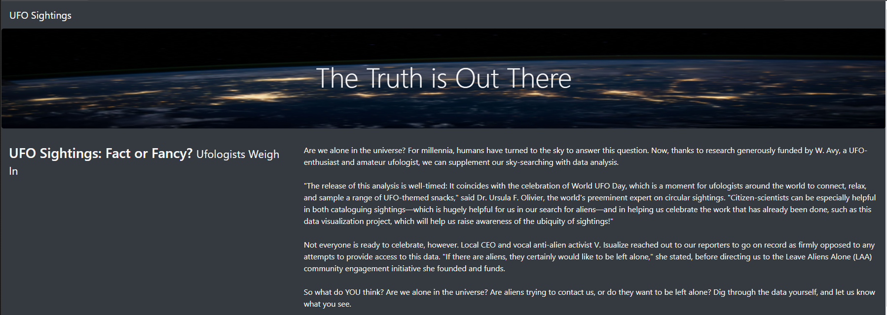
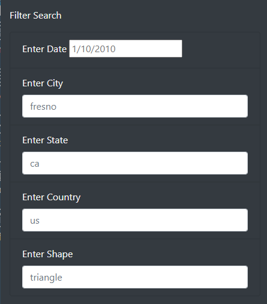
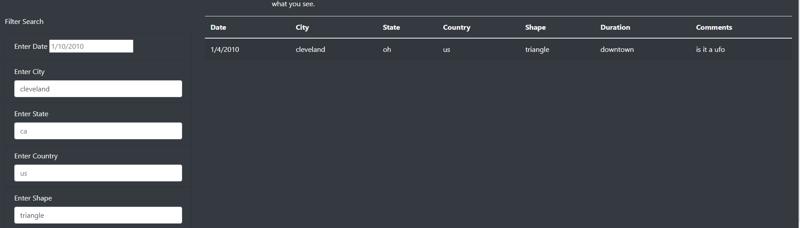
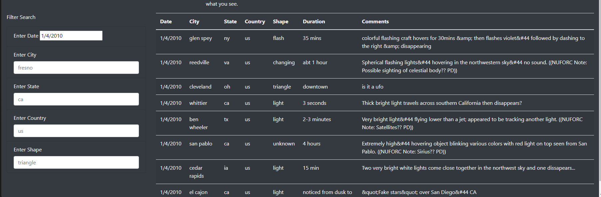
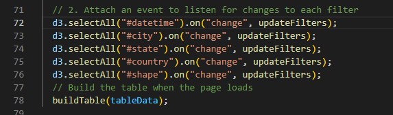
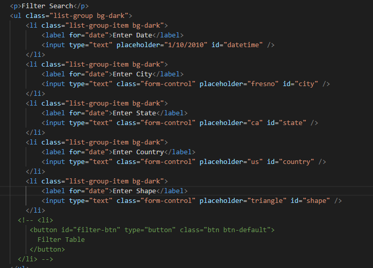
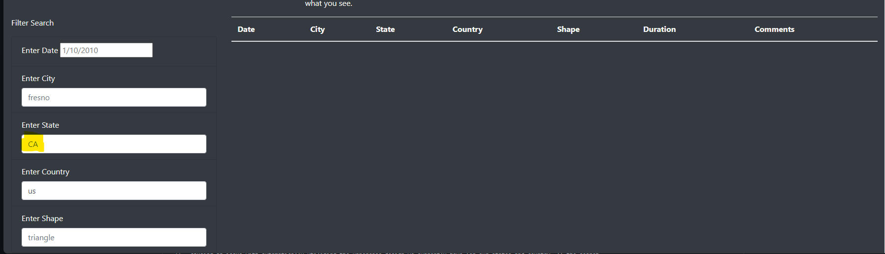

# UFOs

#### Resources: 
Software: JavaScript, HTML, CSS, Bootstrap

## Project Overview:

The overall goal was to produce a functional webpage to allow users the ability to search by different
criteria to obtain information on reported UFO sightings. The production included JavaScript coding for development, 
connected to HTML coding using CSS and Bootstrap to display a visually appealing interactive webpage. 

## Project Results: 

#### Jumbotrn Image display through CSS coding:

#### Functional filters including Date, City, State, Country, and Shape:

#### 1st image (filter by City: cleveland and Shape: triangle) / 2nd image (filter by Date):

#### JavaScript and HTML coding for filter options:

## Project Summary:

- Current drawback:
Case sensitive searching hinders the true ability of the page to provide information, for instance, everything is lowercase
causing an issue with automatically utilizing the uppercase design we currently have for our states and country. If the search
is not completed by matching exactly it will return no items even if they exist. You can see clearly there are Californian states
in our Date return above - but when searched with uppercase "CA" as opposed to the data entry of lowercase "ca" it will not return 
any values.
(example shown below)

- Two additional recommendations:
  - modify the search filters to include any variations of the values in the table to return all applicable matches.
  - pulling additional data from other relavent sources to provide a larger range of feedback in the search. 
